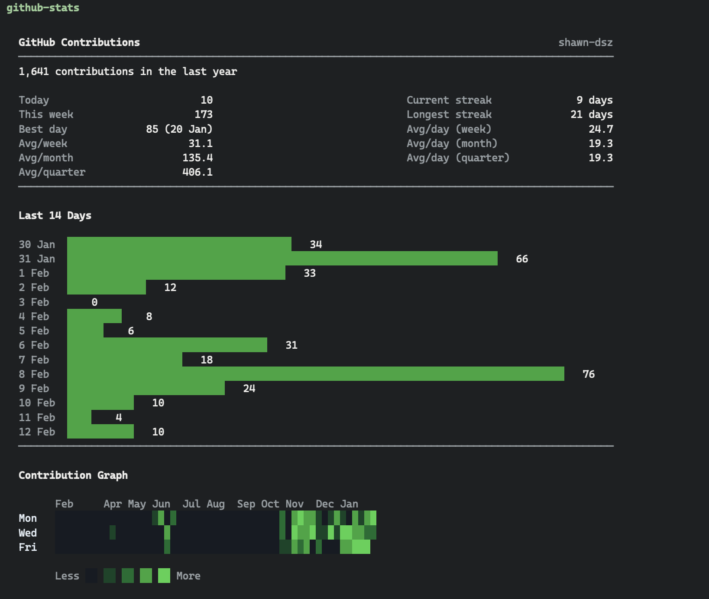

# GitHub Stats

A terminal dashboard for tracking your daily GitHub contributions.



## What it shows

- **Today's commits**, this week's total, and your best day
- **Current and longest streaks**
- **14-day bar chart** with green gradient bars
- **Year-long contribution heatmap** matching GitHub's green palette

## Prerequisites

- [GitHub CLI](https://cli.github.com/) (`gh`) installed and authenticated
- Node.js 22+

## Usage

```bash
npm install
npm start
```

## How it works

Queries the GitHub GraphQL API via `gh api graphql` to fetch your `contributionCalendar` data for the past year. Everything runs in a single TypeScript file with no build step (uses `tsx`).
